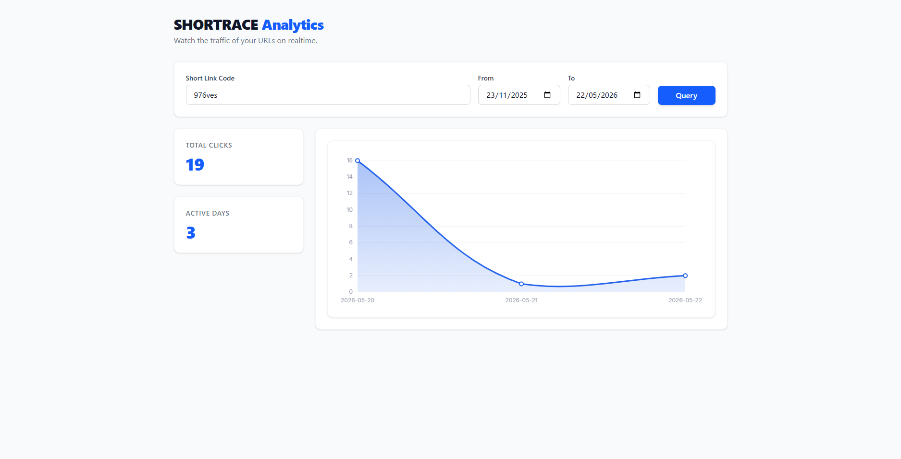

<div align="center">

<h1>🔗 SHORTRACE 🔗</h1>

<h3 style="margin-top: -10px; font-weight: normal;">
ANALYTICS FRONTEND
</h3>

<br/>


</div>

## 🎯 Overview

**ShortRace Analytics Frontend** is the dashboard layer of the ShortRace ecosystem. Built with **Svelte 5 + Vite + TypeScript**, it visualizes click-tracking analytics for shortened links — rendering daily breakdowns and stat summaries in real time. Deployed on AWS as a fully static SPA served through CloudFront CDN with a private S3 backend. Every CI/CD step runs inside a **Docker container** to guarantee environment parity between local and GitHub Actions.

## ✨ Key Features

### 📊 Analytics Dashboard
- **Real-Time Metrics**: Queries the metrics microservice by link code and date range, displaying total clicks and day-by-day breakdowns.
- **Chart.js Integration**: Line chart powered by `chart.js` wrapped in a reusable `LineChart.svelte` component.
- **Toast Notifications**: Lightweight in-app feedback via a reactive Svelte store.

### 🐳 Docker-First CI
- **Reproducible Environments**: Every pipeline job (Lint, Check, Test, Deploy) builds and runs inside the same `dockerfile.ci` image — no environment drift between local and CI.
- **Single Image, All Jobs**: `node:22-alpine` with `aws-cli` baked in covers type checks, test runs, and S3 deployments from the same base.

### ☁️ Cloud-Native Deployment
- **CDN-First**: Served through Amazon CloudFront with HTTPS enforced — no plain HTTP.
- **Private S3 Origin**: Bucket is fully private; CloudFront reads assets via **Origin Access Control (OAC)** — no public bucket policies.
- **SPA Routing**: CloudFront custom error responses redirect all 403/404s back to `index.html` for client-side routing.

### 🏗️ Automated CI/CD
- **Branch-Aware Pipeline**: GitHub Actions runs Lint on every push, adds TypeScript Check and Test coverage on `develop`, and executes the full Deploy chain on `main`.
- **Zero-Downtime Deploys**: `aws s3 sync --delete` replaces only changed files, followed by an automatic CloudFront cache invalidation.

## 🏗️ Project Structure

```text
.
├── .github/
│   ├── docker/
│   │   └── dockerfile.ci          # CI Docker image (node:22-alpine + aws-cli)
│   ├── events/
│   │   ├── push-develop.json      # act event payload for develop branch
│   │   └── push-main.json         # act event payload for main branch
│   └── workflows/
│       └── ci-cd.yml              # GitHub Actions pipeline
├── terraform/
│   ├── provider.tf                # AWS provider & Terraform version
│   ├── variables.tf               # Input variables
│   ├── s3.tf                      # Private S3 bucket + OAC bucket policy
│   ├── cloudfront.tf              # CloudFront distribution + OAC
│   └── outputs.tf                 # Bucket name, distribution ID, public URL
└── src/
    ├── core/
    │   ├── api/                   # Axios HTTP client
    │   ├── models/                # Domain models (Metric, DateRange)
    │   ├── services/              # Metrics service (business logic)
    │   └── stores/                # Svelte reactive stores (Toast)
    └── lib/
        ├── components/            # Reusable UI components (StatCard, LineChart, Toast)
        └── features/              # Page-level feature components (Dashboard)
```

## 📱 Screenshots

<div align="center">
  <table>
    <tr>
      <td align="center"><b>Metrics Page</b></td>
    </tr>
    <tr>
	  <td>
        
      </td>
    </tr>
  </table>
</div>

## 🚀 Getting Started

### Prerequisites

<ul>

<li><strong>Node.js</strong> 22+</li>
<li><strong>Docker</strong> — required to run the CI image locally.</li>
<li><strong>act</strong> — to simulate GitHub Actions locally (<a href="https://github.com/nektos/act">nektos/act</a>).</li>
<li><strong>AWS CLI</strong> configured with appropriate permissions.</li>
<li><strong>Terraform</strong> v1.5.0+ for infrastructure provisioning.</li>

</ul>

### 🛠️ Local Development

<ol>

<li>

<strong>Clone the repository</strong>

```bash
git clone https://github.com/MaySalguedo/SHORTRACE-ANALYTICS-FRONTEND.git
cd SHORTRACE-ANALYTICS-FRONTEND
npm install
```

</li>

<li>

<strong>Start the dev server</strong>

```bash
npm run dev
```

</li>

<li>

<strong>Run the full quality gate before pushing</strong>

```bash
# svelte-check + tsc + eslint + vitest coverage — all in sequence
npm run validate
```

</li>

</ol>

### ☁️ Infrastructure Provisioning

<ol>

<li>

<strong>Provision AWS resources for the first time</strong>

```bash
# Initializes Terraform state and applies the full infrastructure
npm run compile:init
```

</li>

<li>

<strong>Update infrastructure after changes</strong>

```bash
npm run compile
```

</li>

<li>

<strong>Preview changes without applying</strong>

```bash
npm run tf:plan
```

</li>

<li>

<strong>Tear down all resources</strong>

```bash
npm run tf:destroy
```

</li>

</ol>

### 🚀 Manual Deploy (without CI/CD)

Export the required environment variables and run:

```bash
export S3_BUCKET_NAME=your-bucket-name
export CLOUDFRONT_DISTRIBUTION_ID=your-distribution-id

# Build, sync to S3 and invalidate CloudFront in one command
npm run deploy
```

> You can retrieve both values after provisioning with `npm run tf:output`.

## 🛠️ Tech Stack

<ol>

<li><strong>Framework:</strong> Svelte 5 with TypeScript for reactive, type-safe UI development.</li>
<li><strong>Bundler:</strong> Vite 8 — instant HMR in dev, optimized static output for production.</li>
<li><strong>Testing:</strong> Vitest + Testing Library with V8 coverage reporting.</li>
<li><strong>Linting:</strong> ESLint + typescript-eslint + eslint-plugin-svelte.</li>
<li><strong>Styling:</strong> Tailwind CSS v4 with PostCSS.</li>
<li><strong>Task Runner:</strong> <code>npm-run-all</code> (<code>run-s</code>) for sequential script chaining.</li>
<li><strong>CI Runtime:</strong> Docker (<code>node:22-alpine</code> + <code>aws-cli</code>) — same image locally and in GitHub Actions.</li>
<li><strong>CDN:</strong> Amazon CloudFront with Origin Access Control (OAC).</li>
<li><strong>Storage:</strong> Amazon S3 — private bucket, no public access.</li>
<li><strong>IaC:</strong> Terraform for full infrastructure provisioning.</li>
<li><strong>CI/CD:</strong> GitHub Actions with a branch-conditional, Docker-powered pipeline.</li>

</ol>

## ⚙️ CI/CD Pipeline

The pipeline runs automatically on every push. All jobs build and run the same Docker image (`dockerfile.ci`) — guaranteeing identical behaviour between your machine and GitHub's runners.

### Branch behavior

```
All branches:   Lint
develop:        Lint → Check (ts) → Test
main:           Lint → Test → Deploy
```

| Branch | Lint | Check (ts) | Test | Deploy |
|---|---|---|---|---|
| `feature/*`, `fix/*`, etc. | ✅ | ❌ | ❌ | ❌ |
| `develop` | ✅ | ✅ | ✅ | ❌ |
| `main` | ✅ | ✅ | ✅ | ✅ |


### Deploy job steps

1. Builds the CI Docker image from `.github/docker/dockerfile.ci`.
2. Runs `npm run deploy` inside the container, which chains:
   - `build` → `deploy:s3` → `deploy:invalidate`
3. AWS credentials and environment variables are injected at runtime via `-e` flags — never baked into the image.

### 🔐 Required GitHub Secrets & Variables

Navigate to **Settings → Secrets and variables → Actions** in your repository and add:

**Secrets**

| Secret | Description |
|---|---|
| `SHORTRACE_AWS_ACCESS_KEY_ID` | IAM user access key with S3 write + CloudFront invalidation permissions |
| `SHORTRACE_AWS_SECRET_ACCESS_KEY` | Secret key for the IAM user above |
| `SHORTRACE_AWS_REGION` | AWS region where resources are deployed (e.g. `us-east-1`) |
| `SHORTRACE_S3_BUCKET_NAME` | S3 bucket name — from Terraform output `s3_bucket_name` |
| `SHORTRACE_CLOUDFRONT_DISTRIBUTION_ID` | Distribution ID — from Terraform output `cloudfront_distribution_id` |

**Variables** (non-sensitive, visible in logs)

| Variable | Description |
|---|---|
| `VITE_API_URL` | Base URL of the ShortRace metrics API (e.g. `https://api.shortrace.com`) |

> 💡 Run `npm run tf:output` after provisioning to get `SHORTRACE_S3_BUCKET_NAME` and `SHORTRACE_CLOUDFRONT_DISTRIBUTION_ID`.

## 🐳 Testing the Pipeline Locally

The pipeline can be tested locally with **Docker** and **[act](https://github.com/nektos/act)** before pushing. Event payloads are pre-configured in `.github/events/`.

### Build the CI image manually

```bash
docker build -t shortrace-ci -f .github/docker/dockerfile.ci .
```

### Run individual jobs with Docker
```bash
# Lint
docker run --rm shortrace-ci npm run lint

# Type check
docker run --rm shortrace-ci npm run check

# Tests with coverage
docker run --rm shortrace-ci npm run test:cov
```

### Simulate the full pipeline with act
Create a `.secrets` and `.vars` on the root directory to store the secrets and variables.

Install act following the [official guide](https://nektosact.com/installation/index.html), then:

```bash
# Simulate a push to develop (runs Lint → Check → Test)
act push -e .github/events/push-develop.json

# Simulate a push to main (runs Lint → Check → Test → Deploy)
act push -e .github/events/push-main.json --secret-file .secrets --var-file .vars
```

> `act` uses the same `ubuntu-latest` runner image by default. Since jobs build `dockerfile.ci` themselves, Docker must be running on your machine.

### Event payload reference

The `.github/events/` folder contains minimal push payloads that tell `act` which branch to simulate:

```json
// push-develop.json
{ "ref": "refs/heads/develop" }

// push-main.json
{ "ref": "refs/heads/main" }
```

## 📡 npm Scripts Reference

| Script | Description |
|---|---|
| `npm run dev` | Start Vite dev server with HMR |
| `npm run build` | Production build → `dist/` |
| `npm run preview` | Preview the production build locally |
| `npm run check:app` | Run `svelte-check` against `tsconfig.app.json` |
| `npm run check:node` | Run `tsc` against `tsconfig.node.json` |
| `npm run check` | `check:app` → `check:node` in sequence |
| `npm run lint` | Run ESLint across all source files |
| `npm run format` | Auto-format with Prettier |
| `npm run test` | Run Vitest once (no coverage) |
| `npm run test:cov` | Run Vitest with V8 coverage report |
| `npm run validate` | `check` → `lint` → `test:cov` in sequence |
| `npm run tf:init` | Initialize Terraform state |
| `npm run tf:plan` | Preview infrastructure changes |
| `npm run tf:apply` | Apply infrastructure changes |
| `npm run tf:destroy` | Destroy all provisioned resources |
| `npm run tf:output` | Print Terraform outputs |
| `npm run compile:init` | `tf:init` → `tf:apply` → `tf:output` (first deploy) |
| `npm run compile` | `tf:apply` → `tf:output` (subsequent deploys) |
| `npm run deploy:s3` | Sync `dist/` to S3 (`--delete` + cache headers) |
| `npm run deploy:invalidate` | Create CloudFront cache invalidation for `/*` |
| `npm run deploy` | `build` → `deploy:s3` → `deploy:invalidate` |

## 📦 Terraform Outputs

After running `npm run compile:init` or `npm run tf:output`, Terraform prints:

| Output | Description |
|---|---|
| `s3_bucket_name` | Bucket name → use as `SHORTRACE_S3_BUCKET_NAME` secret |
| `s3_bucket_arn` | Full ARN of the bucket |
| `cloudfront_distribution_id` | Distribution ID → use as `SHORTRACE_CLOUDFRONT_DISTRIBUTION_ID` secret |
| `cloudfront_domain_name` | Public HTTPS URL of the deployed dashboard |

<div align="center">

## 📄 License

This software is released under the **MIT License**.<br>
You are free to use, copy, modify, merge, publish, distribute, sublicense, and/or sell copies of the software.

---

&nbsp; <sub>Developed with love — Cartagena de Indias D.T. y C.</sub><br>
&nbsp; <sub>🔓 OPEN SOURCE SOFTWARE — FREE TO DISTRIBUTE 🔓</sub>
</div>